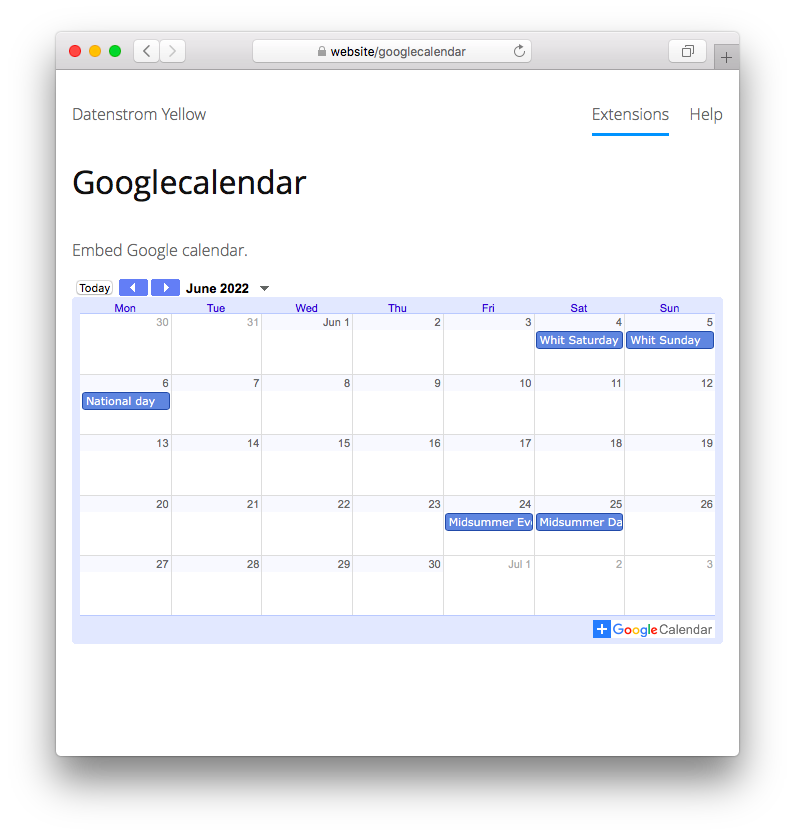

<a href="README-de.md">Deutsch</a> &nbsp; <a href="README.md">English</a> &nbsp; <a href="README-sv.md">Svenska</a>

# Googlecalendar 0.8.17

Bädda in Google-kalender.

## Hur man installerar ett tillägg

[Ladda ner ZIP-filen](https://github.com/annaesvensson/yellow-googlecalendar/archive/refs/heads/main.zip) och kopiera den till din `system/extensions` mapp. [Läs mer om tillägg](https://github.com/annaesvensson/yellow-update/tree/main/README-sv.md).

## Hur man bäddar in en veckokalender

Skapa en `[googlecalendarweek]` förkortning för att visa en vecka.

Följande argument är tillgängliga, alla utom det första argumentet är valfria:

`Id` = offentlig [Google-kalender](https://calendar.google.com/)  
`Theme` = kalendertema, för närvarande endast `light`  
`Style` = kalenderstil, t.ex. `left`, `center`, `right`  
`Width` = kalendebredd, pixel eller procent  
`Height` = kalendehöjd, pixel eller procent  

Du bör veta att tjänsteleverantören samlar in personuppgifter och använder cookies.

## Hur man bäddar in en månadskalender

Skapa en `[googlecalendarmonth]` förkortning för att visa en månad.

Följande argument är tillgängliga, alla utom det första argumentet är valfria:

`Id` = offentlig [Google-kalender](https://calendar.google.com/)  
`Theme` = kalendertema, för närvarande endast `light`  
`Style` = kalenderstil, t.ex. `left`, `center`, `right`  
`Width` = kalendebredd, pixel eller procent  
`Height` = kalendehöjd, pixel eller procent  

Du bör veta att tjänsteleverantören samlar in personuppgifter och använder cookies.

## Hur man bäddar in en evenemangskalender

Skapa en `[googlecalendarevents]` förkortning för att visa en lista.

Följande argument är tillgängliga, alla utom det första argumentet är valfria:

`Id` = offentlig [Google-kalender](https://calendar.google.com/)  
`Date` = startdatum, ÅÅÅÅ-MM-DD format  
`Entries` = antal inlägg att visa per evenemangskalender  

Du bör veta att tjänsteleverantören samlar in personuppgifter och använder cookies.

## Exempel

Bädda in en veckokalender, olika kalendrar:

    [googlecalendarweek en.uk#holiday]
    [googlecalendarweek de.german#holiday]
    [googlecalendarweek sv.swedish#holiday]

Bädda in en veckokalender, olika storlekar:

    [googlecalendarweek sv.swedish#holiday light right 50%]
    [googlecalendarweek sv.swedish#holiday light right 240 240]
    [googlecalendarweek sv.swedish#holiday light right 480 480]

Bädda in en månadskalender, olika kalendrar:

    [googlecalendarmonth en.uk#holiday]
    [googlecalendarmonth de.german#holiday]
    [googlecalendarmonth sv.swedish#holiday]

Bädda in en månadskalender, olika storlekar:

    [googlecalendarmonth sv.swedish#holiday light right 50%]
    [googlecalendarmonth sv.swedish#holiday light right 240 240]
    [googlecalendarmonth sv.swedish#holiday light right 480 480]

Bädda in en evenemangskalender, olika kalendrar:

    [googlecalendarevents en.uk#holiday]
    [googlecalendarevents de.german#holiday]
    [googlecalendarevents sv.swedish#holiday]

Bädda in en evenemangskalender, olika startdatum och antal inlägg:

    [googlecalendarevents sv.swedish#holiday 2022-06-01 5]
    [googlecalendarevents sv.swedish#holiday 2022-09-01 10]
    [googlecalendarevents sv.swedish#holiday 2022-12-01 15]

## Inställningar

Följande inställningar kan konfigureras i filen `system/extensions/yellow-system.ini`:

`GooglecalendarStyle` = kalenderstil, t.ex. `flexible`  
`GooglecalendarApiKey` = din Google API-nyckel  
`GooglecalendarEntries` = antal inlägg att visa per evenemangskalender  

## Tack

Detta tillägg använder [Google-kalender](https://calendar.google.com/). Tack för den kostnadsfria tjänsten.

## Utvecklare

Anna Svensson. [Få hjälp](https://datenstrom.se/sv/yellow/help/).
